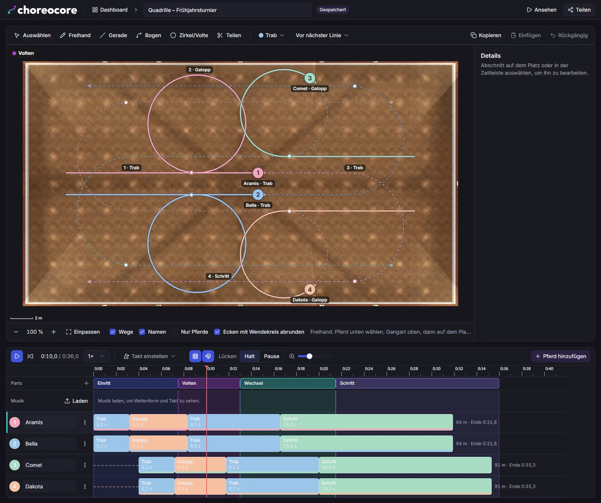
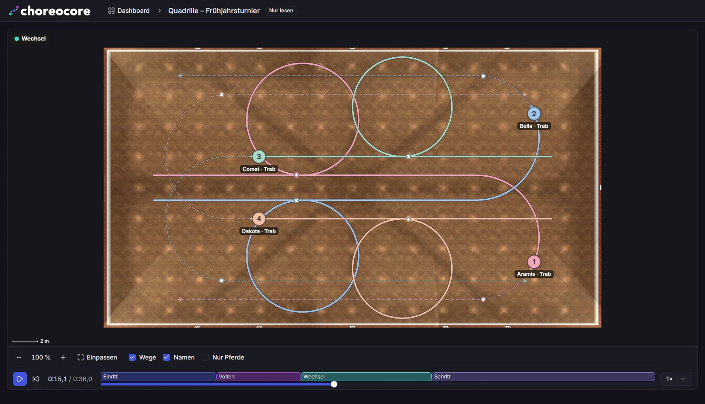

<p align="center">
  <picture>
    <source media="(prefers-color-scheme: dark)" srcset="docs/brand/logo-on-dark.svg">
    
  </picture>
</p>

<p align="center">
  Plan equestrian choreographies to music – freestyle, pas de deux, quadrille.
</p>

<p align="center">
  <a href="https://github.com/SleepyPxnda/choreocore/actions/workflows/ci.yml"></a>
  <a href="LICENSE"></a>
</p>

---

**Choreocore** is a self-hosted web app for riding instructors and riders to plan choreographies: draw the paths of several horses on the floor plan of the arena, arrange them on a timeline to the music, edit them together in real time and play them back as an animation.

The user interface is in German.



## Features

- **Draw paths**: freehand, straight lines, arcs, circles and voltes directly on the arena image. Coordinates are stored in metres, and corners are rounded to the turning circle of the gait.
- **Gaits with speed**: walk, trot, canter and so on, each with a speed (with and without saddle) and a turning circle. Curves that are too tight are flagged.
- **Timeline to music**: load a track, see its waveform and beat, move sections, insert halts and pauses, name parts.
- **Edit together**: several people work on the same plan live; undo applies per person.
- **Share and play back**: share plans with roles (edit, read) or via a read-only link. The playback view shows the choreography as an animation.



## Tech stack

Nuxt 4 (Vue 3, Nitro) · TypeScript · Tailwind + shadcn-vue · PostgreSQL 16 with Drizzle · S3-compatible object storage · Sign-in with Discord (accounts approved by an admin). The domain logic (time model, geometry, turning circle) lives as pure functions in [`packages/core`](packages/core) and runs the same in the browser and on the server.

Logo and icons: [`docs/brand`](docs/brand)

## Requirements

- Docker with Compose
- A Discord application (<https://discord.com/developers/applications>) for sign-in: client ID and secret, and the address `…/auth/discord` under “OAuth2 → Redirects”
- An S3 bucket, e.g. Hetzner Object Storage (private; the app sets a CORS rule for read access itself on startup)
- For development, also Node.js 22 and pnpm (`corepack enable`)

## Development

```bash
cp .env.example .env          # fill in values, at least SUPER_ADMIN_DISCORD_ID and S3
pnpm install
docker compose -f docker/compose.dev.yml up -d   # Postgres
pnpm db:migrate && pnpm db:seed
pnpm dev                      # http://localhost:3000
```

Sign in without Discord (only with `pnpm dev`, only via localhost): `http://localhost:3000/auth/dev-login?username=<SUPER_ADMIN_DISCORD_ID>`, demo user: `anna`.

| Command            | Purpose                                                    |
| ------------------ | ---------------------------------------------------------- |
| `pnpm check`       | Lint, typecheck, formatting – must pass before each commit |
| `pnpm format`      | Write formatting with Prettier                             |
| `pnpm db:generate` | Generate a migration from the changed schema               |
| `pnpm test:core`   | Existing tests of the domain logic (`packages/core`)       |

## Deployment

Production runs with [`docker/compose.prod.yml`](docker/compose.prod.yml): the app (Node 22 with ffmpeg) and PostgreSQL 16. Object storage is an external S3. TLS is handled by a reverse proxy that you put in front of the app yourself.

### Setup

1. Clone the repository on the server and create `.env` from `.env.example`:
   - `POSTGRES_PASSWORD`: a random password (letters and digits only, it ends up in the connection URL); the Compose file sets `DATABASE_URL` itself
   - `S3_*`: endpoint, region, bucket and keys; for Hetzner `S3_FORCE_PATH_STYLE=false`
   - `NUXT_SESSION_PASSWORD`: at least 32 random characters (`openssl rand -hex 32`)
   - `NUXT_OAUTH_DISCORD_CLIENT_ID`, `NUXT_OAUTH_DISCORD_CLIENT_SECRET`
   - `NUXT_OAUTH_DISCORD_REDIRECT_URL=https://<your-domain>/auth/discord` (enter the same in the Discord application)
   - `SUPER_ADMIN_DISCORD_ID`: your Discord user ID; this account is always active and an admin
   - optional: `DISCORD_WEBHOOK_URL` for notifications about new access requests, `APP_PORT` (default 3000)
2. Start:

   ```bash
   docker compose -f docker/compose.prod.yml --env-file .env up -d --build
   ```

   On startup the app applies all pending migrations and creates missing base data (admin account, gaits, arena with placeholder dimensions). Only then does it answer requests; if this fails, it exits and Docker restarts it.

3. Point a reverse proxy with TLS at `http://127.0.0.1:3000`. It must pass WebSockets through (live editing under `/ws/plans/…`) and set `X-Forwarded-Host`/`X-Forwarded-Proto`. Example for Caddy:

   ```
   choreocore.example.org {
   	reverse_proxy 127.0.0.1:3000
   }
   ```

   The app only sets cookies over HTTPS; without TLS, sign-in is not possible.

4. Sign in with the Discord account from `SUPER_ADMIN_DISCORD_ID`. Under “Einstellungen” (settings) maintain the arena image, its dimensions and the gaits; under “Nutzer” (users) approve pending requests.

### Updating

```bash
git pull
docker compose -f docker/compose.prod.yml --env-file .env up -d --build
```

Migrations run automatically on startup.

### Prebuilt image instead of building yourself

The GitHub Action [`image.yml`](.github/workflows/image.yml) builds the image `ghcr.io/sleepypxnda/choreocore` whenever a release is published on GitHub. A release `v1.2.3` gets the tags `1.2.3`, `1.2` and `latest`; a pre-release (e.g. `v1.3.0-rc.1`) only gets its own version tag. On the server you then only need `compose.prod.yml` and `.env`, no source code:

```bash
docker compose -f docker/compose.prod.yml --env-file .env pull app
docker compose -f docker/compose.prod.yml --env-file .env up -d --no-build
```

Choose a different tag with `ZEPHYR_IMAGE` in `.env`, e.g. `ZEPHYR_IMAGE=ghcr.io/sleepypxnda/choreocore:1.2.3`. If the package on GitHub is private, run `docker login ghcr.io` first with a token that has `read:packages`.

### Monitoring

- `GET /api/health` answers `200 {"status":"ok"}` while the database is reachable, otherwise `503`. Docker uses it as a health check (`docker compose … ps`).
- Logs: `docker compose -f docker/compose.prod.yml logs -f app`. The app writes one JSON line per event (`time`, `level`, `msg`, and `err` with a stack trace where applicable).
- Deleted plans are removed permanently after 30 days, daily at 03:00.

### Backups

Set up backups yourself, e.g. daily:

```bash
docker compose -f docker/compose.prod.yml exec -T postgres pg_dump -U zephyr zephyr | gzip > zephyr-$(date +%F).sql.gz
```

Also back up the S3 bucket (music, images) using your provider's tools.

## License

[MIT](LICENSE)
